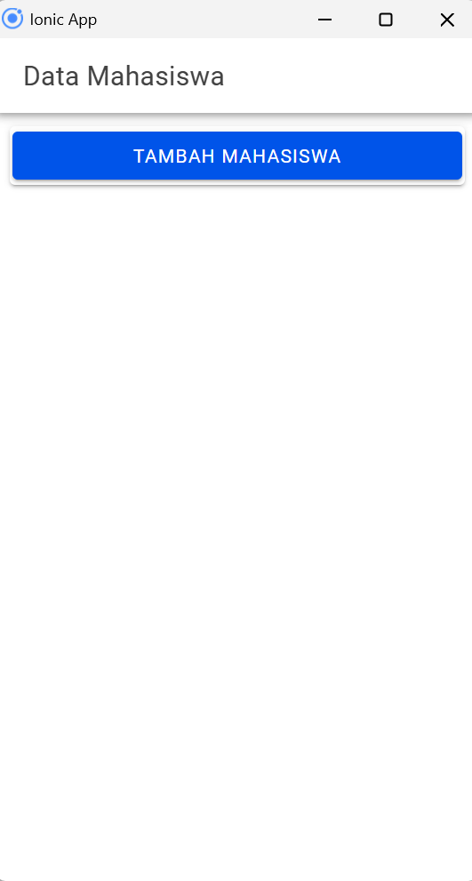
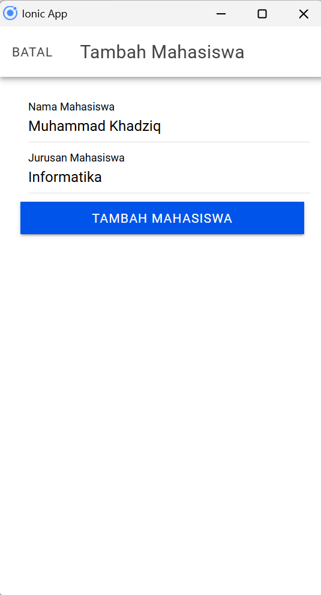
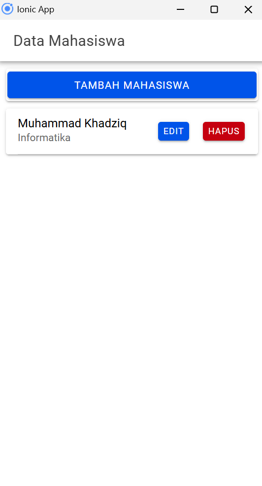
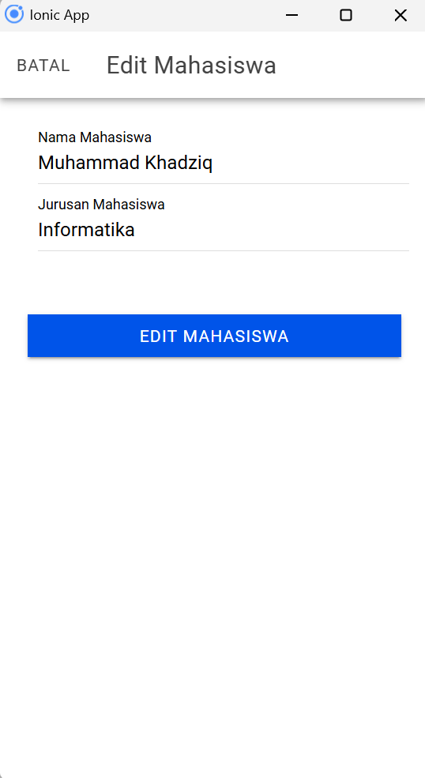
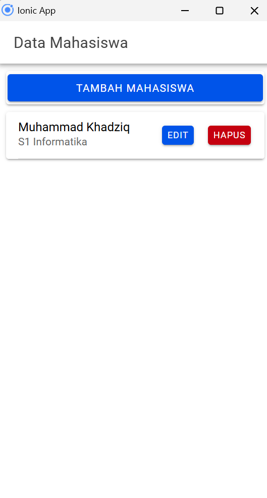
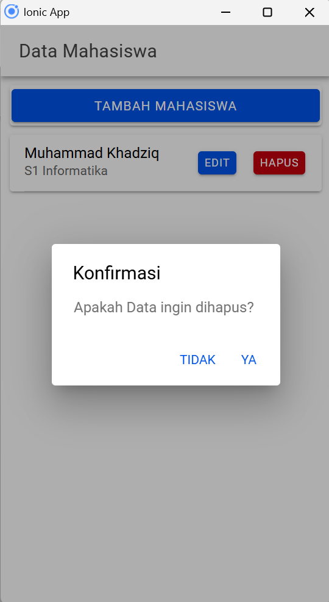

## Penjelasan Proses CRUD 
### 1. **Create (Tambah Mahasiswa)**
   **Method `tambahMahasiswa()`**: Di dalam komponen `MahasiswaPage`, metode ini digunakan untuk menambah data mahasiswa baru.
   **Langkah-langkah**:
   - Ketika tombol **"Tambah Mahasiswa"** ditekan, modal tambah akan terbuka (`openModalTambah(true)`), dan input disiapkan untuk memasukkan data mahasiswa.

     ```typescript
     openModalTambah(isOpen: boolean) {
         this.modalTambah = isOpen;
         this.resetModal();
         this.modalTambah = true;
         this.modalEdit = false;
     }
     ```

   - Setelah pengguna memasukkan data `nama` dan `jurusan`, `tambahMahasiswa()` akan mengambil data tersebut dan mengirimkannya ke server melalui metode `tambah()` pada `ApiService`, menggunakan endpoint `tambah.php`.

     ```typescript
     tambahMahasiswa() {
         if (this.nama != '' && this.jurusan != '') {
             let data = {
                 nama: this.nama,
                 jurusan: this.jurusan,
             };
             this.api.tambah(data, 'tambah.php').subscribe({
                 next: (hasil: any) => {
                     this.resetModal();
                     console.log('berhasil tambah mahasiswa');
                     this.getMahasiswa();
                     this.modalTambah = false;
                 },
                 error: (err: any) => {
                     console.log('gagal tambah mahasiswa');
                 },
             });
         } else {
             console.log('gagal tambah mahasiswa karena masih ada data yg kosong');
         }
     }
     ```

### 2. **Read (Lihat Data Mahasiswa)**
   **Method `getMahasiswa()`**: Metode ini digunakan untuk menampilkan data mahasiswa di halaman utama aplikasi.
   **Langkah-langkah**:
   - Pada inisialisasi komponen (`ngOnInit()`), `getMahasiswa()` dipanggil untuk mengambil data mahasiswa dari server melalui metode `tampil()` pada `ApiService`, yang berinteraksi dengan endpoint `tampil.php`.

     ```typescript
     ngOnInit() {
         this.getMahasiswa();
     }

     getMahasiswa() {
         this.api.tampil('tampil.php').subscribe({
             next: (res: any) => {
                 console.log('sukses', res);
                 this.dataMahasiswa = res;
             },
             error: (err: any) => {
                 console.log(err);
             },
         });
     }
     ```

   - Hasil respon disimpan dalam variabel `dataMahasiswa` dan akan ditampilkan pada elemen `<ion-card>` di halaman `mahasiswa.page.html`.

     ```html
     <ion-card *ngFor="let item of dataMahasiswa">
         <ion-item>
             <ion-label>
                 {{item.nama}}
                 <p>{{item.jurusan}}</p>
             </ion-label>
             <ion-button expand="block" (click)="openModalEdit(true, item.id)">Edit</ion-button>
             <ion-button color="danger" slot="end" (click)="konfirmasiHapus(item.id)">Hapus</ion-button>
         </ion-item>
     </ion-card>
     ```

### 3. **Update (Edit Data Mahasiswa)**
   **Method `editMahasiswa()`**: Metode ini digunakan untuk memperbarui data mahasiswa.
   **Langkah-langkah**:
   - Ketika pengguna menekan tombol **"Edit"** pada salah satu data mahasiswa, modal edit akan terbuka (`openModalEdit(true, item.id)`) dengan data yang akan diedit diambil melalui `ambilMahasiswa()`.

     ```typescript
     openModalEdit(isOpen: boolean, idget: any) {
         this.modalEdit = isOpen;
         this.id = idget;
         console.log(this.id);
         this.ambilMahasiswa(this.id);
         this.modalTambah = false;
         this.modalEdit = true;
     }
     ```

   - Data yang ditampilkan pada form modal diisi dengan `nama` dan `jurusan` dari mahasiswa yang dipilih. Setelah data diperbarui dan tombol **"Edit Mahasiswa"** ditekan, metode `editMahasiswa()` akan mengirim data ke server melalui metode `edit()` pada `ApiService`, menggunakan endpoint `edit.php`.

     ```typescript
     editMahasiswa() {
         let data = {
             id: this.id,
             nama: this.nama,
             jurusan: this.jurusan
         };
         this.api.edit(data, 'edit.php')
             .subscribe({
                 next: (hasil: any) => {
                     console.log(hasil);
                     this.resetModal();
                     this.getMahasiswa();
                     console.log('berhasil edit Mahasiswa');
                     this.modalEdit = false;
                 },
                 error: (err: any) => {
                     console.log('gagal edit Mahasiswa');
                 }
             });
     }
     ```

### 4. **Delete (Hapus Data Mahasiswa)**
   **Method `hapusMahasiswa()`**: Digunakan untuk menghapus data mahasiswa.
   **Langkah-langkah**:
   - Ketika pengguna menekan tombol **"Hapus"**, `konfirmasiHapus(id)` dipanggil untuk menampilkan konfirmasi.

     ```typescript
     async konfirmasiHapus(id: any) {
         const alert = await this.alertController.create({
             header: 'Konfirmasi',
             message: 'Apakah Data ingin dihapus?',
             buttons: [
                 {
                     text: 'Tidak',
                     role: 'cancel',
                     handler: () => {
                         console.log('Hapus dibatalkan');
                     }
                 },
                 {
                     text: 'Ya',
                     handler: () => {
                         this.hapusMahasiswa(id);
                     }
                 }
             ]
         });

         await alert.present();
     }
     ```

   - Jika pengguna mengonfirmasi penghapusan, `hapusMahasiswa()` akan dipanggil untuk mengirim permintaan hapus ke server melalui metode `hapus()` pada `ApiService`, dengan endpoint `hapus.php?id=` diikuti `id` mahasiswa yang akan dihapus.

     ```typescript
     hapusMahasiswa(id: any) {
         this.api.hapus(id, 'hapus.php?id=').subscribe({
             next: (res: any) => {
                 console.log('sukses', res);
                 this.getMahasiswa();
                 console.log('berhasil hapus data');
             },
             error: (error: any) => {
                 console.log('gagal');
             },
         });
     }
     ```

## Screenshot Hasil 

### 1. Halaman Home
Menampilkan daftar mahasiswa yang sudah ditambahkan.



### 2. Tambah Mahasiswa
Formulir untuk menambahkan data mahasiswa baru.



### 3. Setelah Menambahkan Mahasiswa
Tampilan setelah mahasiswa berhasil ditambahkan.



### 4. Edit Mahasiswa
Formulir untuk mengedit data mahasiswa yang sudah ada.



### 5. Setelah Edit Mahasiswa
Tampilan setelah mahasiswa berhasil diperbarui.



### 6. Hapus Mahasiswa
Konfirmasi untuk menghapus data mahasiswa.


